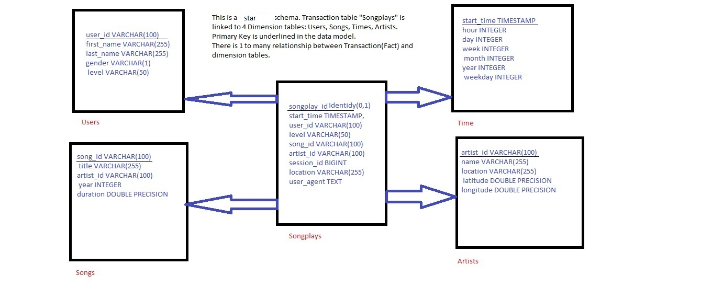
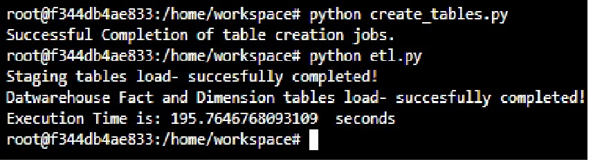

# Project 3: Sparkify- Song Play DW and Analysis in AWS cloud environment 

<h1>Purpose of the Project</h1>

<p>
Sparkify is an online music startup that supports two types of users. First type of users belong to level "free", who are non-paying and second type of users belong to level "paid". Paid users generate the revenue for Sparkify and Free users are potential "Paid" users, who may subscribe to "Paid Level" in future. 

To support this business, it is important for Sparkify to collect correct data and metrics around users, songs, artists, usage patterns etc. This Project aims to create a data model that can store the required data, support business queries against the data, and can help calculate relevant metrics. With time volume of data/transactions has increased and Sparkify is now leverating AWS S3 for storage of raw data, and Redshift for Data Warehouse. It also is using Python for ETL and related programming.
    
</p>


## Summary
* [Data Model](#Data-Model)
* [ETL Details](#ETL-Details)
* [Project Artifacts](#Project-Artifacts)
* [SQL Queries](#SQL-Queries)
--------------------------------------------


#### Data Model
This is the datamodel of the DW, which is following a classical start schema methodology.
The Fact Table is "songplays" which is inturn linked to dimension tables-
Time, Users, Songs, Artists.





--------------------------------------------

#### ETL Details


<b> First we need to set up the environment: </b><br>
Please follow the below steps and refer to notebook "Setting Environment.ipynb": <br>
1. First we need to create an User with Admin privileges and save the credentials.<br>
2. Next we need to prepare the configuration file with above credntials, and parameters to create cluster and connecting to it.<br>
3. Next we create a 4 node, dc2.large redshift cluster and let it become available. We create a database DWH with custom user and password.<br>
4. We need to ensure during cluster creation that it is attached to right role with right privileges(read access to S3).
5. We next note the ARN and Endpoint/Hostname.<br>
6. We update the configuration file of step 2 with above details as those will be needed to connect to AWS-redshift.<br>


<b> Next we can start DDL creation and ETL activities: </b><br>
Open Terminal Session and  insert these commands in order to run the table creation and data load: <br><br>
<I> Below will create the tables </I> <br>
`` python create_tables.py`` <br>

<I> Below will execute ETL process of loading the staging tables first from JSON log files in S3 and will then load DW tables </I> <br>
<I> This step also prints the total execution time in seconds.</I> 
<br>
`` python etl.py`` <br>



----------------------------

#### Project Artifacts

* <b> create_tables.py </b> - This script will drop old tables (if exist) ad re-create new tables
* <b> etl.py </b> - This script will read JSON every file contained in /data folder, parse them, <br> build relations though logical process and ingest data 
* <b> sql_queries.py </b> - This file contains variables with SQL and COPY statements needed for the project in String formats, <br> 
* <b> Setting Environment.ipynb </b> - This notebook creates the cluster, and runs SQLs after data is loaded
* <b> Executable Readme.ipynb </b>- This notebook, execute the markdown file to give a look and feel of final output of the md-file.
----------------------------

#### SQL Queries

<I> Getting Most Used User Agent:</I>
``` SQL
     SELECT user_agent from 
    (  SELECT user_agent, count(user_agent) cnt_user_agent FROM songplays GROUP BY user_agent )abc 
    where cnt_user_agent in 
    ( 
    SELECT MAX(cnt_user_agent) max_cnt_user_agent from 
    ( SELECT user_agent, count(user_agent) cnt_user_agent FROM songplays GROUP BY user_agent)
    abc
    );
```

<I> Getting the busiest hours, that is the hours when most songs are being played:</I>
``` SQL
    SELECT hour, count(songplay_id) cnt_plays from 
    songplays a inner join time b 
    on a.start_time=b.start_time 
    group by hour 
    order by cnt_plays desc LIMIT 5; 
```

<I> Average Daily Active Users:</I>
``` SQL
    SELECT tot_daily_usr_cnt/num_days 
    from 
    (
    SELECT SUM(daily_usr_cnt) tot_daily_usr_cnt from         
    (SELECT day,month,year, count(distinct(user_id)) daily_usr_cnt
    from songplays a
    INNER join time b 
    on a.start_time=b.start_time 
    group by day,month, year 
    )a
    )c    
    INNER join  
     (
     SELECT COUNT(*) num_days from 
     
    (SELECT day,month,year
     from songplays a 
     INNER join time b
     on a.start_time=b.start_time
      GROUP BY day, month, year) b 
       )b1
     on (1=1);
```


----------------------------